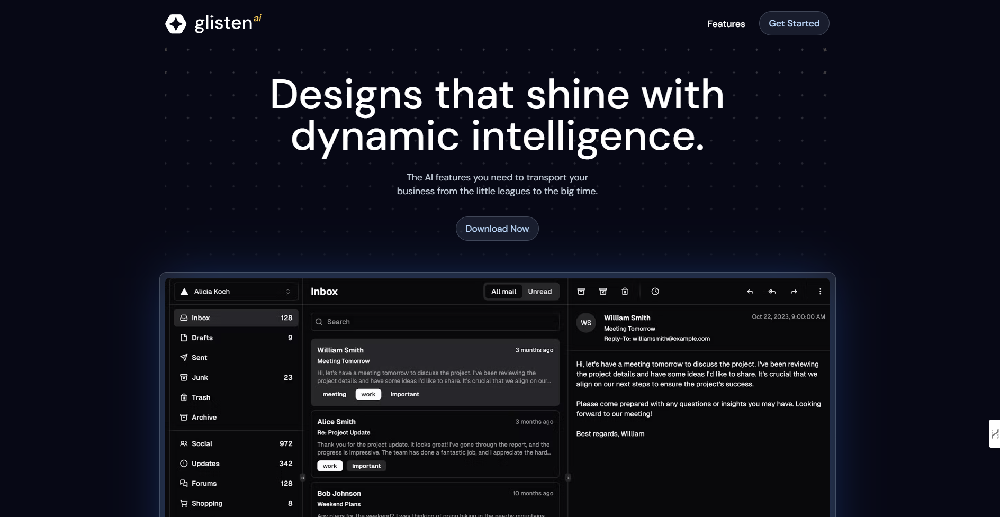

# Glisten AI Webpage

## Table of contents

- [Glisten AI Webpage](#glisten-ai-webpage)
  - [Table of contents](#table-of-contents)
  - [Overview](#overview)
    - [Description](#description)
    - [Screenshot](#screenshot)
    - [Links](#links)
    - [Built with](#built-with)
  - [Author](#author)

## Overview

### Description

Glisten AI is a fictional company that can be described as a pioneering fintech company where artificial intelligence meets innovative design to deliver outstanding solutions.

### Screenshot

### Links

- Live Site URL: [Here](https://)

### Built with

- React
- Tailwind CSS
- Next.JS
- Prismic
- Typescript

## Author

- Website - [Miguel Alvarez](https://ghostharddev.vercel.app)
- LinkedIn - [Miguel Alvarez](https://www.linkedin.com/in/ghosthard117)